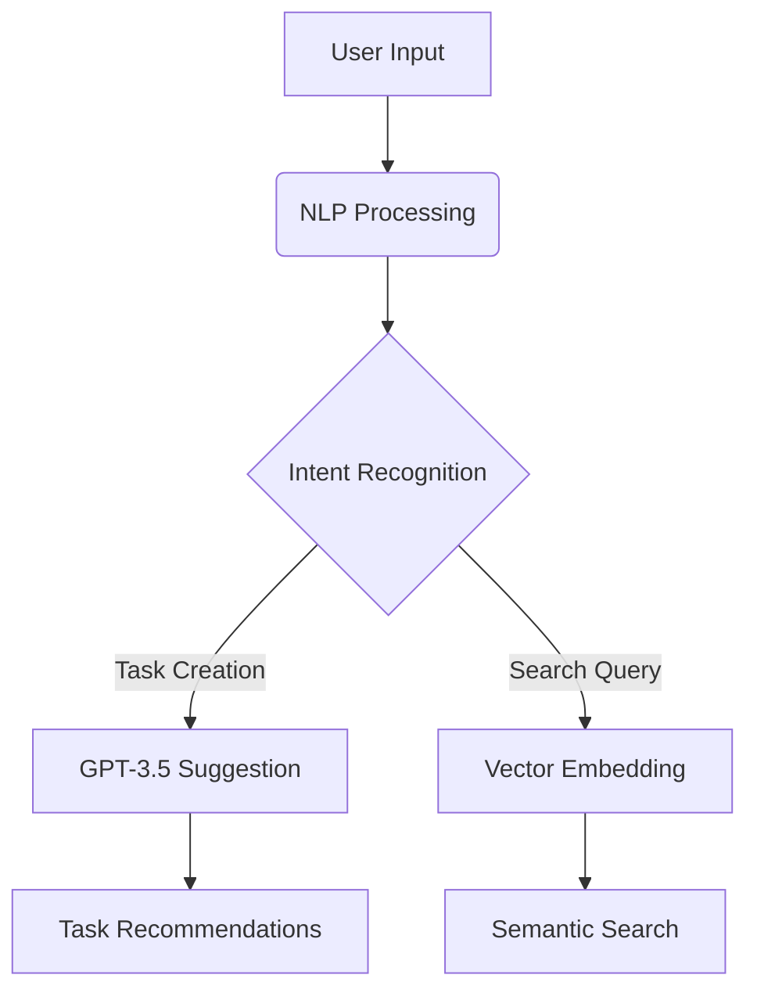

# Todo-AI: Intelligent Task Management System

**An AI-Powered Task Management Solution with Smart Recommendations and Context-Aware Features**

[](https://opensource.org/licenses/MIT)
[](https://nextjs.org/)
[](https://convex.dev)

## 📝 Table of Contents

- [Project Overview](#-project-overview)
- [Key Features](#-key-features)
- [Tech Stack](#-tech-stack)
- [Installation](#-installation)
- [Project Structure](#-project-structure)
- [AI Integration](#-ai-integration)
- [Database Architecture](#-database-architecture)
- [API Endpoints](#-api-endpoints)
- [Contributing](#-contributing)
- [License](#-license)

## 🌟 Project Overview

Todo-AI is an intelligent task management system that combines traditional todo list features with AI-powered capabilities. Designed as part of our final year computer science project, this system demonstrates modern web development practices and AI integration.

Key Differentiators:

- Context-aware task suggestions using OpenAI GPT-3.5
- Vector search capabilities for semantic task retrieval
- Real-time collaboration features
- Cross-platform accessibility with mobile-first design
- Advanced project management capabilities

## 🚀 Key Features

### Core Functionality

- **Smart Task Creation**

  - AI-generated task suggestions
  - Natural language processing for task input
  - Recurring task templates
  - Priority-based task sorting

- **Project Management**

  - Multi-level project organization
  - Collaborative project spaces
  - Progress tracking metrics
  - Gantt-chart style timelines

- **Advanced Features**
  - Context-aware search (title, description, labels)
  - Task dependency management
  - Deadline prediction engine
  - Productivity analytics dashboard

### AI Integration

- **Auto-Suggest System**

  - GPT-3.5 powered task recommendations
  - Missing subtask identification
  - Deadline estimation
  - Task categorization

- **Natural Language Processing**
  - Voice-to-task conversion
  - Email integration with auto-task creation
  - Meeting note parsing

## 🛠 Tech Stack

### Frontend

- **Framework**: Next.js 14 (App Router)
- **UI Library**: Shadcn UI + Radix Primitives
- **State Management**: React Context + Convex
- **Styling**: Tailwind CSS + CSS Modules
- **Form Handling**: React Hook Form + Zod

### Backend

- **Runtime**: Node.js 18+
- **Database**: Convex (Real-time Document DB)
- **Auth**: NextAuth.js v5 (OAuth 2.0)
- **AI**: OpenAI API (GPT-3.5-turbo)
- **Search**: Convex Vector Search

### DevOps

- **CI/CD**: Vercel Platform
- **Testing**: Jest + React Testing Library
- **Linting**: ESLint + Prettier
- **Monitoring**: Sentry (Error Tracking)

## 🛠 Installation

### Prerequisites

- Node.js v18+
- Convex account
- OpenAI API key
- Google OAuth credentials

### Setup Instructions

1. Clone repository:

   ```bash
   git clone https://github.com/yourusername/todo-ai.git
   cd todo-ai
   ```

2. Install dependencies:

   ```bash
   npm install
   ```

3. Configure environment variables:

   ```bash
   cp .env.example .env.local
   ```

   Update values in `.env.local`

4. Initialize Convex:

   ```bash
   npx convex dev
   ```

5. Start development server:
   ```bash
   npm run dev
   ```

## 📁 Project Structure

```plaintext
todo-ai/
├── app/               # Next.js application routes
├── convex/            # Database schema & server functions
├── components/        # Reusable UI components
├── actions/           # Server actions
├── lib/               # Shared utilities
├── public/            # Static assets
└── tests/             # Unit & integration tests
```

Detailed Component Hierarchy:

- **Core Modules**

  - Task Management (CRUD operations)
  - Project Organization (Nested structures)
  - AI Integration (OpenAI services)
  - Authentication (OAuth flows)

- **Supporting Systems**
  - Search Engine (Vector + Keyword)
  - Notification System (Web + Email)
  - Analytics Dashboard (Data visualization)
  - Settings Management (User preferences)

## 🤖 AI Integration

### Architecture Overview



### Key AI Features

1. **Smart Task Generation**

   - Analyzes existing tasks
   - Suggests related tasks using cosine similarity
   - Generates subtasks based on parent task context

2. **Deadline Prediction**

   - Estimates task duration using historical data
   - Factors in user productivity patterns
   - Adjusts for task complexity

3. **Auto-Categorization**
   - Natural language classification
   - Label assignment using zero-shot learning
   - Context-aware project suggestions

## 📊 Database Architecture

### Convex Schema Design

```javascript
// convex/schema.ts
export default defineSchema({
  users: defineTable({
    name: v.string(),
    email: v.string(),
    // ... other fields
  }),

  projects: defineTable({
    title: v.string(),
    owner: v.id("users"),
    // ... other fields
  }),

  tasks: defineTable({
    title: v.string(),
    description: v.string(),
    vector: v.array(v.number()),
    // ... other fields
  }),
});
```

### Data Relationships

- **1:M** User → Projects
- **1:M** Project → Tasks
- **M:M** Tasks ↔ Labels
- **1:M** Tasks → Subtasks

## 📡 API Endpoints

### Core Endpoints

| Method | Endpoint          | Description             |
| ------ | ----------------- | ----------------------- |
| POST   | /api/tasks        | Create new task         |
| GET    | /api/tasks/search | Vector + keyword search |
| PATCH  | /api/tasks/{id}   | Update task properties  |
| DELETE | /api/tasks/{id}   | Archive task            |

### AI Endpoints

| Method | Endpoint        | Description               |
| ------ | --------------- | ------------------------- |
| POST   | /api/ai/suggest | Generate task suggestions |
| POST   | /api/ai/analyze | Task complexity analysis  |

## 🤝 Contributing

We welcome contributions! Please follow these steps:

1. Fork the repository
2. Create your feature branch (`git checkout -b feature/amazing-feature`)
3. Commit your changes (`git commit -m 'Add some amazing feature'`)
4. Push to the branch (`git push origin feature/amazing-feature`)
5. Open a Pull Request

## 📜 License

This project is licensed under the MIT License - see the [LICENSE](LICENSE) file for details.

---

**Developed with ❤️ by [Saksham Gupta](https://github.com/0xsaksham)**

**[Department of Computer Science and Technology](https://cst.mait.ac.in/)**

**[Maharaja Agrasen Institute of Technology](https://mait.ac.in/)**

**2025 Major Project**
